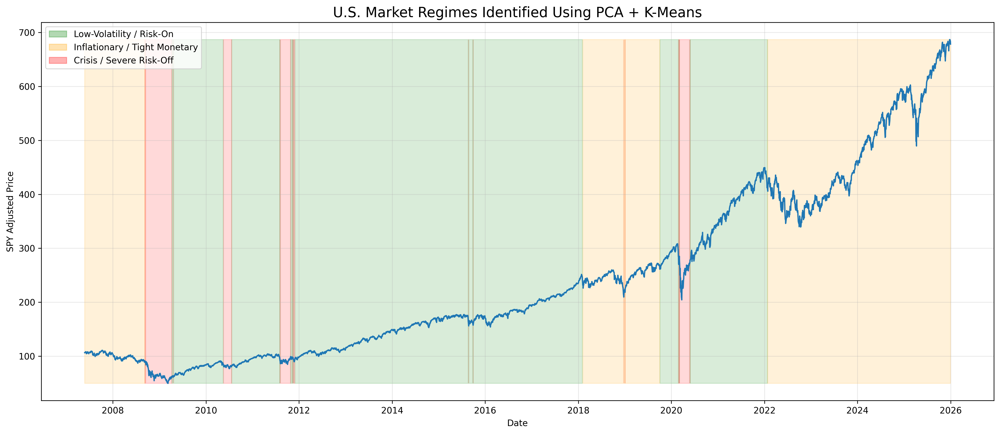
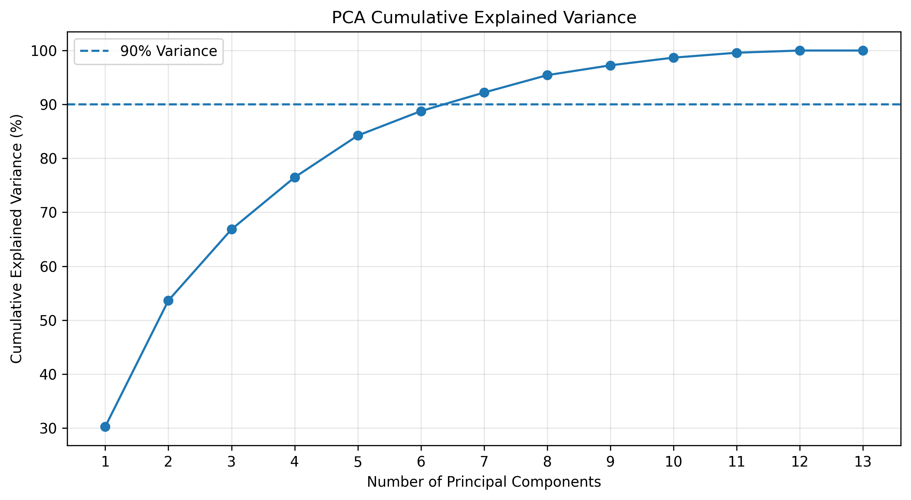
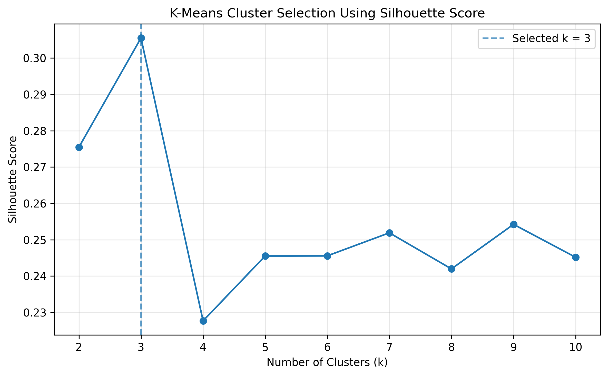
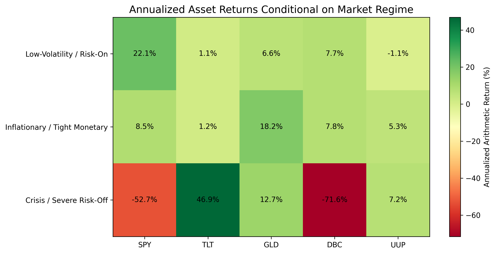

# systematic-market-regime-detection
Unsupervised market regime detection using PCA, K-Means, macroeconomic indicators, and cross-asset data.
# Systematic Market Regime Detection & Cross-Asset Analysis

Unsupervised market-regime detection using **PCA, K-Means clustering, macroeconomic indicators, and cross-asset market data**.

## Overview

This project investigates whether unsupervised machine learning can identify economically meaningful market regimes from macroeconomic and financial-market data.

Using **4,681 daily observations** and **13 market and macroeconomic features**, the analysis applies:

- Standardization
- Principal Component Analysis (PCA)
- K-Means clustering
- Silhouette analysis
- Historical regime validation
- Cross-asset performance analysis
- Regime-transition analysis
- Clustering-stability testing

The final model identifies three interpretable market regimes:

1. **Low-Volatility / Risk-On**
2. **Inflationary / Tight Monetary**
3. **Crisis / Severe Risk-Off**

## Key Results

- PCA reduces **13 features to 7 principal components** while retaining **92.21% of total variance**.
- Silhouette analysis selects **3 clusters** as the preferred K-Means solution.
- The model classifies:
  - Lehman Brothers bankruptcy as **Crisis / Severe Risk-Off**
  - The 2011 U.S. credit downgrade as **Crisis / Severe Risk-Off**
  - The March 2020 COVID crash as **Crisis / Severe Risk-Off**
  - The June 2022 inflation/rate-hike environment as **Inflationary / Tight Monetary**
- Cross-asset behavior differs materially across regimes:
  - **SPY** performs strongest during Risk-On conditions
  - **GLD** performs particularly well during Inflationary / Tight Monetary conditions
  - **TLT** performs strongly during Crisis conditions
- K-Means clustering is stable across tested random initializations, with **ARI = 1.00** across all tested seeds.
  
### Market Regimes Through Time



## Data

### Market Data

Market data are sourced from Yahoo Finance.

| Ticker | Representation |
|---|---|
| SPY | U.S. equities / S&P 500 |
| TLT | Long-term U.S. Treasuries |
| GLD | Gold |
| DBC | Broad commodities |
| UUP | U.S. dollar |
| ^VIX | Expected S&P 500 volatility |

### Macroeconomic Data

Macroeconomic data are sourced from Federal Reserve Economic Data (FRED).

Features include:

- Year-over-year inflation
- Unemployment rate
- Federal Funds Rate
- 10-Year Treasury yield
- 2-Year Treasury yield
- 10Y–2Y yield-curve spread

Monthly macroeconomic variables are lagged by one monthly observation as a conservative approximation of information availability.

## Feature Set

The final model uses 13 features:

### Market Features

- SPY 60-day momentum
- SPY 30-day realized volatility
- VIX level
- TLT 60-day momentum
- GLD 60-day momentum
- DBC 60-day momentum
- UUP 60-day momentum

### Macroeconomic / Rate Features

- Inflation YoY
- Unemployment
- Federal Funds Rate
- 10-Year Treasury yield
- 2-Year Treasury yield
- Yield-curve spread

## Methodology

```text
Market & Macro Data
        ↓
Feature Engineering
        ↓
Data Alignment
        ↓
Standardization
        ↓
PCA
        ↓
Cluster Selection
        ↓
K-Means
        ↓
Regime Interpretation
        ↓
Historical Validation
        ↓
Cross-Asset Performance Analysis
```

## PCA

PCA is used to reduce the dimensionality of the standardized feature set.

The first **7 principal components retain 92.21% of cumulative explained variance**, providing substantial dimensionality reduction while preserving most of the information in the original 13 features.


## Regime Selection

K-Means models with **2 through 10 clusters** are evaluated using silhouette scores.

The highest silhouette score occurs at:

**k = 3, silhouette score = 0.3055**

This supports the final three-regime specification.



## Identified Regimes

### Low-Volatility / Risk-On

Characterized by:

- Strong positive equity momentum
- Relatively low realized volatility
- Lower VIX levels

### Inflationary / Tight Monetary

Characterized by:

- Higher inflation
- Elevated Federal Funds Rate
- Higher Treasury yields
- Moderate market volatility

### Crisis / Severe Risk-Off

Characterized by:

- Strongly negative equity momentum
- Very high realized volatility
- VIX above 40 on average
- Strong Treasury momentum
- Severe commodity weakness

## Cross-Asset Performance

Annualized arithmetic returns conditional on regime:



| Regime | SPY | TLT | GLD | DBC | UUP |
|---|---:|---:|---:|---:|---:|
| Low-Volatility / Risk-On | 22.13% | 1.11% | 6.59% | 7.71% | -1.12% |
| Inflationary / Tight Monetary | 8.54% | 1.20% | 18.17% | 7.78% | 5.29% |
| Crisis / Severe Risk-Off | -52.71% | 46.93% | 12.69% | -71.57% | 7.17% |

These figures represent annualized averages of daily returns observed within each regime. They are not realized calendar-year returns or compound annual growth rates.

## Regime Persistence

The identified regimes exhibit strong one-day persistence:

| Current Regime | Probability of Remaining in Same Regime |
|---|---:|
| Low-Volatility / Risk-On | 99.43% |
| Inflationary / Tight Monetary | 99.71% |
| Crisis / Severe Risk-Off | 94.70% |

## Robustness

The final three-cluster model was re-estimated using multiple K-Means random seeds.

Across all tested initializations:

**Adjusted Rand Index = 1.00**

This indicates identical cluster assignments across the tested random seeds.

## Limitations

This project is an **ex-post historical classification framework**, not a live trading system.

Key limitations include:

- PCA, standardization, and K-Means are fitted using the full historical sample
- The analysis does not include a real-time out-of-sample trading backtest
- Macroeconomic series may contain revised historical values
- Economic regime labels are assigned after examining cluster characteristics
- Results depend on the selected features, lookback windows, and historical sample
- Historical asset relationships may not persist in the future

## Future Research

Potential extensions include:

- Rolling or expanding-window estimation
- Out-of-sample regime classification
- Regime-aware portfolio construction
- Transaction costs and implementation delays
- Gaussian Mixture Models
- Hidden Markov Models
- Credit spreads, market breadth, liquidity, and earnings features

## Tools

- Python
- pandas
- NumPy
- yfinance
- fredapi
- scikit-learn
- matplotlib

## Notebook

The complete analysis, including data collection, feature engineering, PCA, clustering, historical validation, and cross-asset analysis, is available in the full notebook:

[View the full analysis notebook](systematic_market_regime_detection.ipynb)
